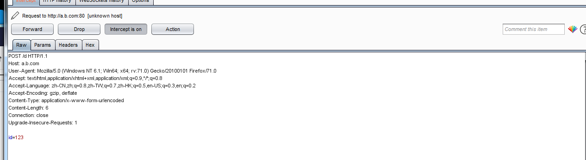

## CSRF漏洞

csrf漏洞原理很简单，主要思想就是借助有权限的人之手，完成我们想要完成的事情。如存在某个新增后台管理员的请求http://xxxx/admin.php?a=addUser&username=huahua&password=112xasd123asd 。然而我们自己当然是没有这个权限的，但是如果我们让管理员点击这个链接，我们就可以达到新增一个名为huahua的管理员账户的目的，这就是一次成功的CSRF攻击。攻击原理很简单，下面主要谈谈CSRF防御方法的Bypass。

CSRF防御一般使用csrf-token和referer校验。在介绍Bypass之前首先说一下同源策略。

### 同源策略

**源的定义:**如果两个页面的协议、端口、域名都相同，则这两个页面有相同的源。

不受同源策略影响的标签有以下几个

```
<script src="..."></script>，，<link>，<iframe>
```

在同源策略的影响下如ajax等方式不能够跨域请求资源。然而上面的几个标签不受影响并且可以做到在访问src中的内容时携带目的网站的cookie访问。

### Token:

csrf token一般由一个用户带着cookie请求服务端后，服务端生成并下发一个csrf token，在提交表单时校验表单的csrf-token和服务端生成的csrf token是否相同，相同则通过校验。

token如果正常写的话不会出现漏洞，因此可以用一些组合漏洞的方式打。如配合xss读取页面中的csrf token，然后将该token写入到存在csrf的提交表单，完成一次csrf攻击。至于其他方面了解的不多，等遇到了再记录一下。

### Referer绕过:

1、空Referer绕过

 在实际环境中，服务器很多CGI由于一些历史原因，必须允许空Referer的请求。比如：老的客户端版本请求的时候就没有Referer，因此为了兼容一些老版本用户，服务器也会接收空referer的请求。构造空referer可以使使用iframe标签完成

```
<html>
    <body>
       <iframe src="data:text/html;base64,PGZvcm0gbWV0aG9kPXBvc3QgYWN0aW9uPWh0dHA6Ly9hLmIuY29tL2Q+PGlucHV0IHR5cGU9dGV4dCBuYW1lPSdpZCcgdmFsdWU9JzEyMycvPjwvZm9ybT48c2NyaXB0PmRvY3VtZW50LmZvcm1zWzBdLnN1Ym1pdCgpOzwvc2NyaXB0Pg==">
    </body> 
</html>
```

base64编码内容为

```
<form method=post action=http://a.b.com/d><input type=text name='id' value='123'/></form><script>document.forms[0].submit();</script>
```

访问上面的iframe页面后会收到如下的数据包，可以看到是没有referer字段的



2、不合格的校验

当后端开发人员校验不严格时，如某网站域名为www.huahua.com。 我们可以在自己的网页上设置如http://mysite/huahua.com/index.html页面。index.html中放置csrf内容。这样referer就是http://mysite/huahua.com/index.html。在后端校验为referer中是否包含huahua.com域名时可以绕过该限制。

或者使用如http://www.xxx.huahua.com.cn 这样的域名绕过。

3、其他二级域名

挖掘其他二级域名的漏洞，如bbs.huahua.com插入一个

```

```

诱导管理员访问，触发csrf漏洞。对于post型的csrf可以配合xss在js中添加自动提交表单。

## JSONP劫持

JSONP为解决跨域传输数据产生的一种前后端交流方式。具体介绍可以看这个链接： https://www.cnblogs.com/52php/p/5677775.html 

讲道理JSONP劫持也算是一种CSRF，绕过可以参考上面绕过referer得方式。

另外jsonp场景中也可以尝试篡改callback形成一个xss漏洞。