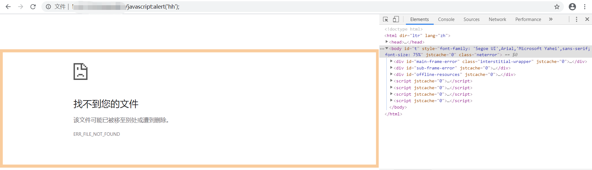
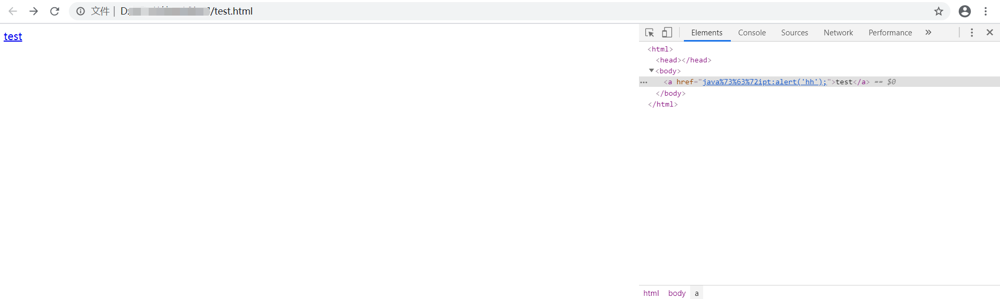
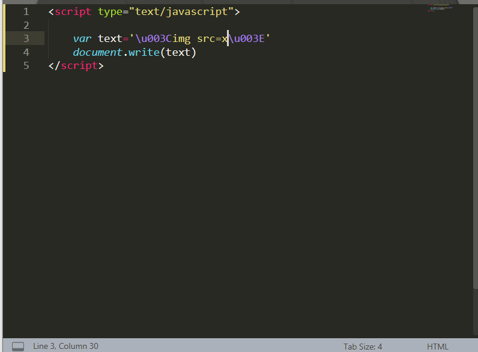
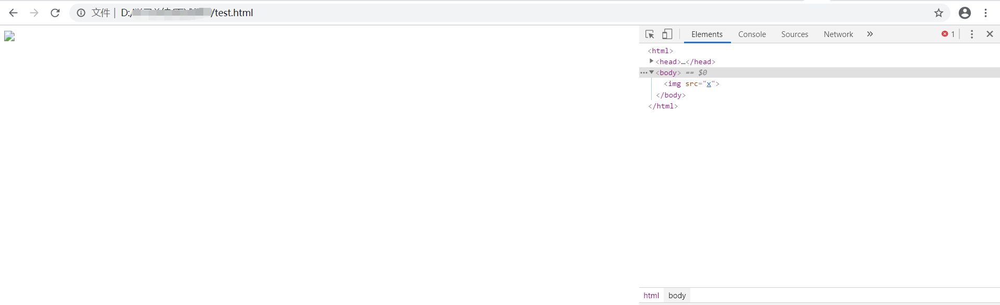

## xss漏洞

### 概念

本质: xss的本质问题就是让对方浏览器执行攻击者插入的js。  

**按传统类型区分：**

* 存储型xss:数据库中被污染的数据取出时未经过过滤直接拼接在了html中，造成了js代码的执行。

* 反射型xss:url中的参数可控，通过后端代码操作且未经过滤就直接拼接在了html中，造成了js代码的执行。
* dom型xss:前端js的dom操作了攻击者可控的url内容并直接拼接在了html中，造成了js代码的执行

**按照交互区分:**

* 存储型xss:无需受害者交互即可完成攻击
* 反射型xss:包括dom型xss，需要受害者交互才可以达成攻击

参考链接: https://blog.csdn.net/xysoul/article/details/46012325 

### 漏洞挖掘

**反射XSS:**

FUZZ敏感接口,改变url的参数查看response内容是否可控且能够利用。

JSFinder: https://xz.aliyun.com/t/5390 

**存储型xss:**

寻找可控的从数据库展现到前端的数据，尝试用双引号、尖括号等标签闭合。

### Bypass

#### 通过编码Bypass

**案例一：**

在同时解码HTML编码、URL编码、js编码时浏览器在渲染时先进行HTML解码，再进行URL实体解码，最后进行JS的unicode解码：HTML->URL->JS

以下面为例子:

```
<a href="javascript:alert('&#x25;&#x35;&#x63;&#x75;&#x30;&#x30;&#x36;&#x38;&#x25;&#x35;&#x63;&#x75;&#x30;&#x30;&#x36;&#x38;');">test</a>
```


```
&#x25;&#x35;&#x63;&#x75;&#x30;&#x30;&#x36;&#x38;&#x25;&#x35;&#x63;&#x75;&#x30;&#x30;&#x36;&#x38;
```

上面这段内容同时在HTML标签内、href中的URL内、javascript后的js内。所以其会经过HTML实体解码、URL解码、js解码。

* HTML实体解码后为

  ```
  %5cu0068%5cu0068
  ```

* URL解码后为

  ```
  \u0068\u0068
  ```

* js解码后为

  ```
  hh
  ```

因此最后会弹出hh的弹窗

**案例二:**

经过案例一的实验后我们想到，如果我们将javascript关键字编码是否可以绕过一些waf的检测，接下来做一些简单实践。

```
<a href="java%73%63%72ipt:alert('hh');">test</a>
```

将上面的代码保存为html后点击a标签



我们发现页面跳转到了/javascript:alert('hh')



通过审查元素发现href的内容浏览器没有被自动转码出来，因此在解析时java%73%63%72ipt:alert('hh');并不会被认为时javascript进行解析，而是作为一个url进行跳转。

```
<a href="java&#x73;&#x63;&#x72;ipt:alert('hh');">test</a>
```

而我们使用上面的代码时,浏览器解析时会先把HTML转码，转码后暴露出完整的javascript: 这是会将javascript后的内容作为js进行解析。


### 修复方案

1、在HTML标签、属性中输出使用HTMLEncode进行编码

2、在script标签中输出使用JavascriptEncode进行编码

3、在事件中输出使用JavascriptEncode编码

4、在CSS中输出用类似JavaScriptEncode的方式。将除了字母、数字外的所有字符都编码成十六进制形式”\uHH“ 

5、在地址中输出的话 一般如果变量是整个URL，则先检查变量是否以“http”开头（不是则帮忙添加http），保证不会出现伪协议类的XSS攻击。然后再对变量进行URLEncode。 

PS:附加一个某个地方进行不合理过滤会导致得绕过



text模拟的是从通过js取下来的一段攻击者可控的内容，当开发人员试图通过document.write将text输出时，开发者可能会使用常规的HTMLEncode。然而我们可以看到，HTMLEncode对于text字符来说并无效果，在页面输出时还会直接将\标签拼接在HTML中。



按照上面得修复方案，我们应该对这种方式使用JavascriptEncode编码。