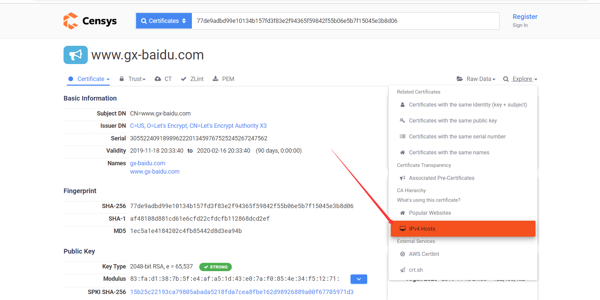
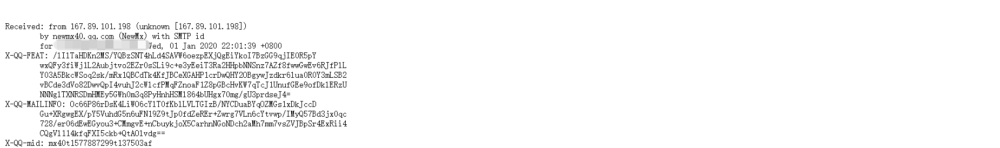
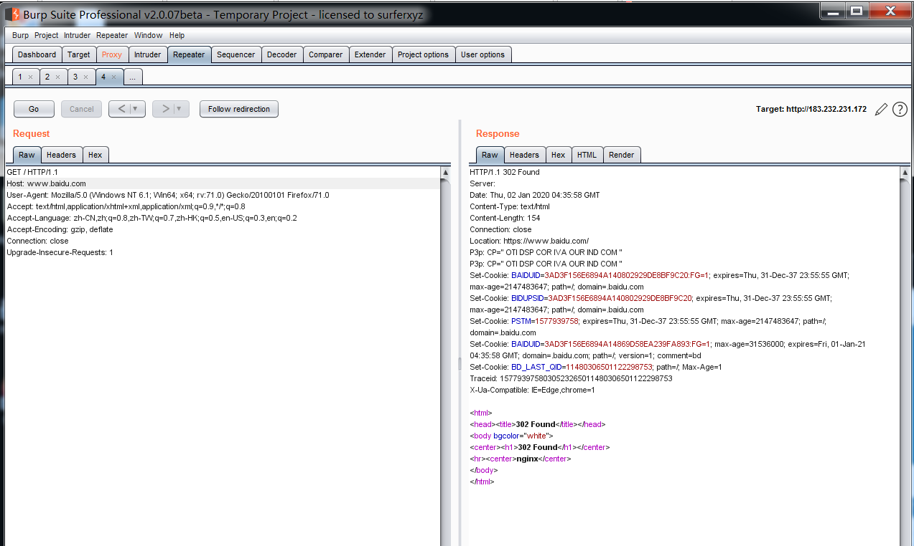

# 绕过CDN寻找真实ip

1、查看DNS历史解析记录

有时在网站在未挂上dns的时候其ip会被一些爬虫网站记录，可以利用这点找到其真实ip，附一些常用网站。

```
http://viewdns.info/

https://x.threatbook.cn/

http://www.17ce.com/

https://dnsdb.io/zh-cn/

https://securitytrails.com/

http://www.ip138.com/

https://github.com/vincentcox/bypass-firewalls-by-DNS-history
```

2、https证书

通过censys等平台可以查看到证书的对应的ipv4地址



3、mail服务



上面时一封由github发送过来的邮件，unknown后面的ip就是github的smtp服务器的ip。在我们渗透的时候如果可以使用其邮件服务器发件功能，就可以轻易的获得一个真实ip。

4、找到未设置CDN的域名

其实这种情况在很多时候都是很管用的，因为很多域名可能连自己公司都忘了还有这个域名了，因此没有挂CDN。我见过的还有一些邮服也不挂CDN。找到这类域名后可以直接得到一个真实ip。

5、域名碰撞

在前面的情况中，有时我们只能找到一个域名的真实ip，在我们找到了一个ip后应该怎么样找到其他的域名对应的真实ip呢。这时我们可以使用碰撞的思想。

我们可以在发送给http://ip:port 发送请求的时候将host修改为我们想要测试的域名(本来情况下host应该是Ip的)。如果host在这个ip上可以出现正常页面，那么就说明这个host是在这个ip上解析的。如果爆一些403类似的错误，则这个host并不是在这个ip上面解析的。

因此我们可以将已经的到真实ip的那个ip C端做成一个列表。所有的host做成一个列表。看这个ip能否解析出正确的host页面来判断。



6、利用shadan的http.favicon.hash功能对比全网ip的icon hash值和我们给出的icon hash值得关系，从而得到真实ip。(由于我们有shadon得号，这种方法没用过，不过看起来很合理，大家自测)

```
https://github.com/Ridter/get_ip_by_ico/blob/master/get_ip_by_ico.py
```

7、SSRF

SSRF和第三种mail服务有异曲同工之妙，都是利用其内部服务器访问我们。在SSRF中我们可以nc监听服务器80端口,然后使用SSRF漏洞向我们公网ip得80端口发送http请求，从而得到真实ip。